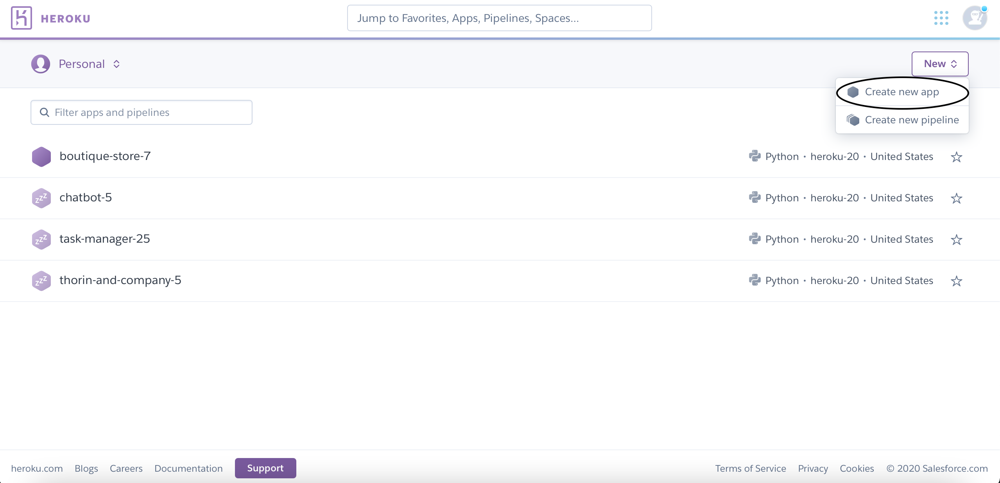
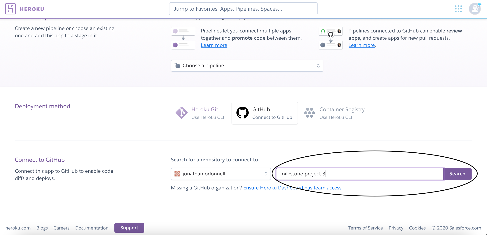
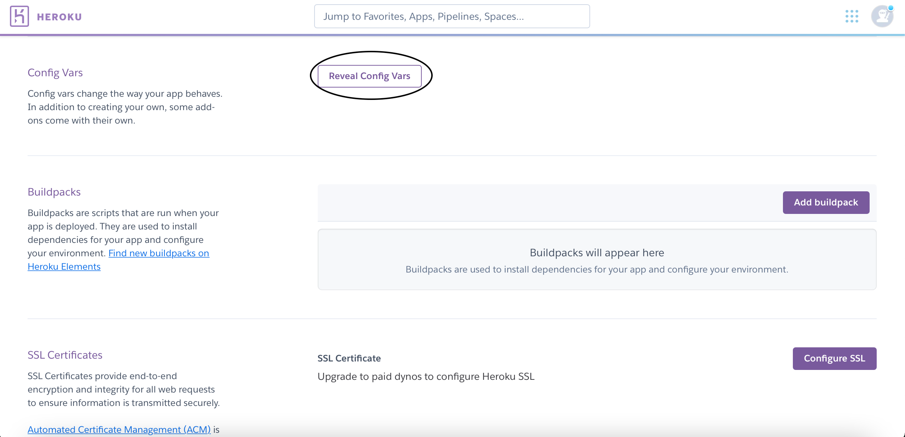

# Tech Reviews Website

[View the live website here](http://tech-reviews.herokuapp.com/)

Tech Reviews is a fictitious consumer electronics reviews and consumer advice company based in Manchester, United Kingdom. This is the organisation's main marketing website which aims to inform customers about the different consumer electronics products currently available in the marketplace and persuade them to make a purchase. It provides customers with information and reviews for a variety of products including phones, tablets, laptops, speakers and smart watches. The website is designed to be responsive and easy to navigate on a range of devices.

## User Experience (UX)

### User Stories

1. As a customer or a site owner, I want to be able to navigate the website easily to find the content I am looking for.
2. As a customer, I want to be able to find out about the latest consumer electronics products.
3. As a customer, I want to be able to sign up for email updates about the latest consumer electronics products.
4. As a customer, I want to be able to search for products that meet my needs.
5. As a customer, I want to be able to view product information and read reviews for each product.
6. As a customer, I want to be able to sign in to my account or sign up for an account if I don't already have one. 
7. As a customer, I want to be able to write reviews of products.
8. As a customer, I want to be able to easily access my reviews.
9. As a customer, I want to be able to edit and delete my reviews.
10. As a site owner, I want to be able to add, edit and delete products.
11. As a customer, I want to be able to contact the organisation to get answers to any questions I may have.
12. As a customer, I want to be able to find the organisation's social media links.

## Technologies Used

### Languages Used

1. [HTML5:](https://en.wikipedia.org/wiki/HTML5/)
   - HTML5 was used for the sturcture of the webpages.
2. [CSS3:](https://en.wikipedia.org/wiki/Cascading_Style_Sheets/)
   - CSS3 was used for the styling of the webpages.
3. [JavaScript:](https://en.wikipedia.org/wiki/JavaScript/)
   - JavaScript was used for the interactive features on the webpages.
4. [Python:](https://www.python.org/)
    - Python was used to communicate the database information to the browser.

### Frameworks, Libraries & Programs Used

1. [Bootstrap 4.5](https://getbootstrap.com/)
   - Bootstrap was used for the navbar, footer accordion, toasts, forms, buttons, filters modal, sort by dropdown buttons, featured products carousel cards and reviews cards. Bootstrap was also used for the grid which assists with the responsiveness of the website and for the styling.
2. [Hover.css](https://ianlunn.github.io/Hover/)
   - Hover.css was used for the hover effects on the social media icons.
3. [Font Awesome](https://fontawesome.com/)
   - Font Awesome was used throughout the website to enhance the user experience by adding icons.
4. [Popper.js](https://popper.js.org/)
   - Bootstrap uses Popper.js to make the navbar responsive.
5. [jQuery](https://jquery.com/)
   - JQuery was used throughout the website for the interactive features.
6. [Slick Slider](https://kenwheeler.github.io/slick/)
    - Slick Slider was used for the featured products carousel. License is [here](slick_license.md).
7. [Flask](https://flask.palletsprojects.com/en/1.1.x/)
   - Flask was used for the routing of the appliction and for the messages.
8. [Flask Paginate](https://pythonhosted.org/Flask-paginate/)
   - Flask Paginatie was used for the pagination on the reviews, category reviews and product management pages.
9. [Jinja](https://jinja.palletsprojects.com/en/2.11.x/)
   - Jinja was used for the templating.
10. [Flask-PyMongo](https://flask-pymongo.readthedocs.io/en/latest/)
    - Flask-PyMongo was used to interact with the database. 
11. [MongoDB](https://owlcarousel2.github.io/OwlCarousel2/)
    - A MongoDB database was used to store the data used in the project.
12. [Gitpod](https://www.gitpod.io/)
    - Gitpod was used to write the code for this project and gitpod terminal was used to commit changes to Git and Push them to GitHub.
13. [Git](https://git-scm.com/)
    - Git was the version control system used for this project.
14. [GitHub](https://github.com/)
    - GitHub is used to store the project's code and any other required files.
15. [Heroku](https://www.heroku.com/)
    - Heroku is used to host the deployed website.
16. [Balsamiq](https://balsamiq.com/)
    - Balsamiq was used to create the wireframes during the design phase of the project.

## Deployment

### Heroku

The project was deployed to Heroku using the following steps:

1.  Log in to Heroku and click on the "New" button.
    
2.  Click on the "Create new app" button in the dropdown list.
    
3.  Enter a name for the app and check that it is available.
    
4.  Click the "Create app" button.
    
5.  Scroll down to the connect to GitHub section, enter the project's GitHub repository name in the repo-name field and click the "Search" button.
    
6.  Click the "Connect" button next to the GitHub repository.
    
7.  Scroll down to the automatic deploys section and click the "Enable Automatic Deploys" button.
    
8.  Scroll back up to the top of the page and click the "Settings" tab.
    
9.  Scroll down to the convig vars section and click the "Reveal Config Vars" button.
    
10. Enter the key and value for each config var and click the "add" button.
    

More information about deploying a website to Heroku is available [here](https://devcenter.heroku.com/categories/deployment).

### Forking the GitHub repository

The GitHub Repository can be forked using the following steps:

1.  Log in to GitHub and locate the project's [GitHub Repository](https://github.com/jonathan-odonnell/milestone-project-3).
2.  At the top-right of the repository, click the "Fork" Button.
    

More information about forking a GitHub repository is available [here](https://docs.github.com/en/github/getting-started-with-github/fork-a-repo).

### Making a Local Clone

A local clone of the project can be created using the following steps:

1.  Log in to GitHub and locate the project's [GitHub Repository](https://github.com/jonathan-odonnell/milestone-project-3).
2.  Under the repository name, click the "Code" button.
    
3.  To clone the repository using HTTPS, under "Clone with HTTPS", click the clipboard button to copy the repository URL.
    
    To clone using SSH click "Use SSH" and then click the clipboard button.
    
    
4.  Open Git Bash
5.  Change the current working directory to the location where you want to store the cloned repository.
6.  Type `git clone` and then paste the URL you copied in Step 3.

```
$ git clone https://github.com/jonathan-odonnell/milestone-project-3.git
```

7.  Press enter to create your clone.

```
Cloning into 'milestone-project-3'...
remote: Enumerating objects: 1900, done.
remote: Total 1900 (delta 0), reused 0 (delta 0), pack-reused 1900
Receiving objects: 100% (1900/1900), 74.54 MiB | 4.68 MiB/s, done.
Resolving deltas: 100% (1290/1290), done.
```

More information about making a local clone of a GitHub repository is available [here](https://docs.github.com/en/github/creating-cloning-and-archiving-repositories/cloning-a-repository).