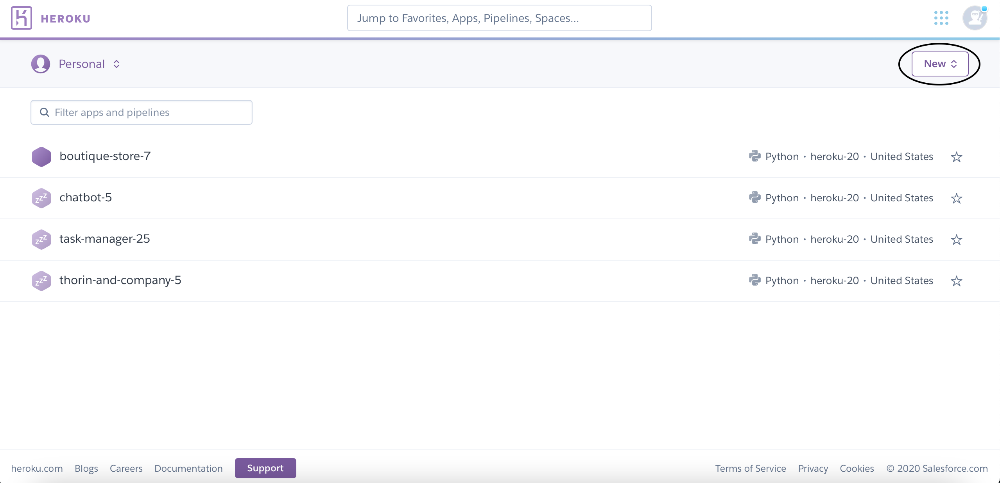
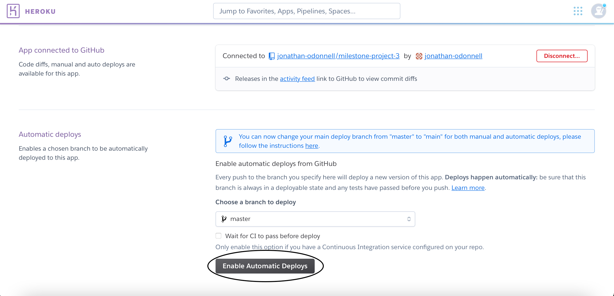

## Deployment

### Heroku

The project was deployed to Heroku using the following steps:

1.  Log in to Heroku and click on the "New" button.
    
2.  Click on the "Create new app" button in the dropdown list.
    
3.  Enter a name for the app and check that it is available.
    
4.  Click the "Create app" button.
    
5.  Scroll down to the connect to GitHub section, enter the project's GitHub repository name in the repo-name field and click the "Search" button.
    
6.  Click the "Connect" button next to the GitHub repository.
    
7.  Scroll down to the automatic deploys section and click the "Enable Automatic Deploys" button.
    
8.  Scroll back up to the top of the page and click the "Settings" tab.
    
9.  Scroll down to the convig vars section and click the "Reveal Config Vars" button.
    
10. Enter the key and value for each config var and click the "add" button.
    

More information about deploying a website to Heroku is available [here](https://devcenter.heroku.com/categories/deployment).

### Forking the GitHub repository

The GitHub Repository can be forked using the following steps:

1.  Log in to GitHub and locate the project's [GitHub Repository](https://github.com/jonathan-odonnell/milestone-project-3).
2.  At the top-right of the repository, click the "Fork" Button.
    

More information about forking a GitHub repository is available [here](https://docs.github.com/en/github/getting-started-with-github/fork-a-repo).

### Making a Local Clone

A local clone of the project can be created using the following steps:

1.  Log in to GitHub and locate the project's [GitHub Repository](https://github.com/jonathan-odonnell/milestone-project-3).
2.  Under the repository name, click the "Code" button.
    
3.  To clone the repository using HTTPS, under "Clone with HTTPS", click the clipboard button to copy the repository URL.
    
    To clone using SSH click "Use SSH" and then click the clipboard button.
    
    
4.  Open Git Bash
5.  Change the current working directory to the location where you want to store the cloned repository.
6.  Type `git clone` and then paste the URL you copied in Step 3.

```
$ git clone https://github.com/jonathan-odonnell/milestone-project-3.git
```

7.  Press enter to create your clone.

```
Cloning into 'milestone-project-3'...
remote: Enumerating objects: 1900, done.
remote: Total 1900 (delta 0), reused 0 (delta 0), pack-reused 1900
Receiving objects: 100% (1900/1900), 74.54 MiB | 4.68 MiB/s, done.
Resolving deltas: 100% (1290/1290), done.
```

More information about making a local clone of a GitHub repository is available [here](https://docs.github.com/en/github/creating-cloning-and-archiving-repositories/cloning-a-repository).